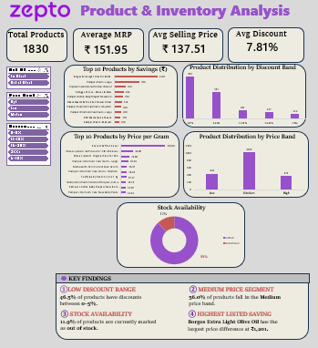

# 📊 Zepto Product & Inventory Analysis

An Excel-based data analysis project focused on **product pricing, discounts, inventory availability, price bands, and potential savings** using Zepto product data.

## 📌 Project Overview

This project analyzes **1,830 product records** using Microsoft Excel to identify patterns in product pricing, discounts, inventory availability, and price segmentation.

The project includes data preparation, calculated fields, PivotTable-based analysis, interactive slicers, and an Excel dashboard.

## 🎯 Objectives

* Analyze product pricing and selling prices
* Examine discount patterns across products
* Identify products with the highest potential savings
* Analyze product distribution across price bands
* Examine inventory availability and out-of-stock products
* Identify products with high price per gram
* Present findings through an interactive Excel dashboard

## 🛠️ Tools & Skills

* Microsoft Excel
* Data Cleaning & Preparation
* Excel Formulas
* PivotTables
* PivotCharts
* Slicers
* Data Visualization
* Exploratory Data Analysis
* Dashboard Development
* Business Analysis

## 📂 Dataset

The dataset contains product-level information including:

* Product Name
* MRP
* Discount Percentage
* Selling Price
* Available Quantity
* Weight
* Price per Gram
* Out-of-Stock Status
* Product Quantity
* Discount Amount
* Price Band
* Discount Band

The analysis is based on **1,830 product records**.

## 📊 Dashboard

The interactive dashboard provides:

* Total Products
* Average MRP
* Average Selling Price
* Average Discount
* Top 10 Products by Potential Savings
* Product Distribution by Discount Band
* Top 10 Products by Price per Gram
* Product Distribution by Price Band
* Stock Availability
* Interactive filters for Price Band, Discount Band, and Stock Status

### Dashboard Preview

## 🔍 Key Insights

* The average MRP across the analyzed products is approximately **₹151.95**.
* The average selling price is approximately **₹137.51**.
* The overall average discount is approximately **7.81%**.
* The **0–5% discount band** contains the largest number of products.
* The **Medium price band** contains the largest share of products.
* Approximately **11.9% of products are marked as out of stock**.
* The products with the highest potential savings include several higher-priced grocery and household products.

## 📈 Analysis Performed

### Pricing Analysis

Compared MRP and selling prices to understand product pricing patterns.

### Discount Analysis

Grouped products into discount bands and analyzed the distribution of discounts.

### Inventory Analysis

Examined in-stock and out-of-stock products using PivotTables and interactive slicers.

### Price Band Analysis

Analyzed the distribution of products across Low, Medium, and High price segments.

### Product-Level Analysis

Identified products with high potential savings and high price per gram.

## 📁 Project Files

| File                       | Description                                       |
| `Zepto_Data_Analysis.xlsx` | Complete Excel analysis and interactive dashboard |
| `images/dashboard.png`     | Dashboard preview                                 |

## 💡 Skills Demonstrated

**Excel • Data Cleaning • Exploratory Data Analysis • PivotTables • PivotCharts • Slicers • Data Visualization • Dashboarding • Business Analysis**
